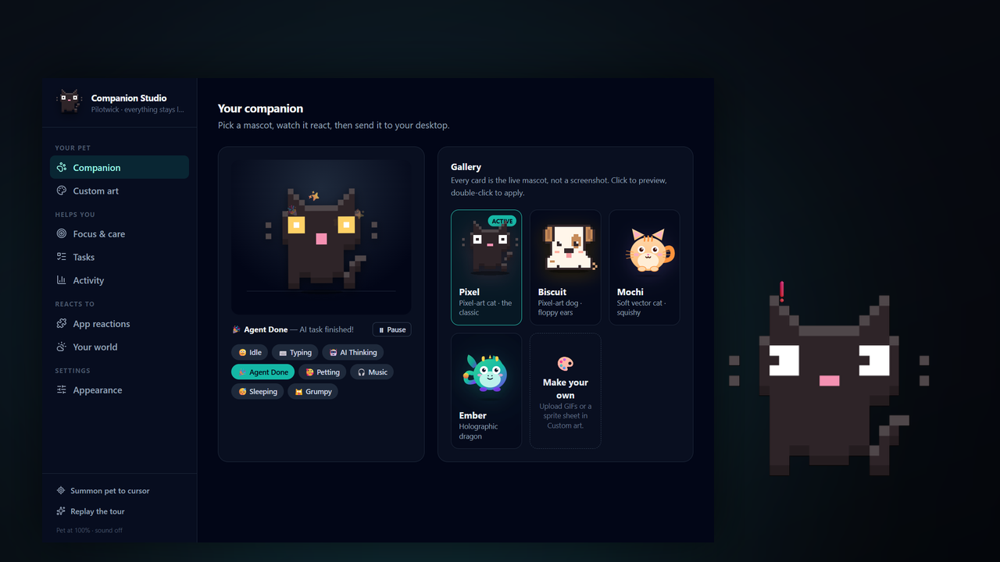

<div align="center">

# 🐾 Pilotwick — Your Desktop Companion

**A tiny, context-aware creature that lives on your screen — and actually helps.**
It watches your cursor, cheers when your AI finishes a long task, holds your to-do list, runs your focus timer, and can be *anything* you want it to be.

[](https://tauri.app)
[](https://react.dev)
[](https://www.rust-lang.org)
[](LICENSE)
[](CONTRIBUTING.md)

*1.3 MB installer · ~30 MB RAM · no account, no telemetry, no cloud*

**Status:** v0.1.0 — early, but everything documented here works. Built and tested on Windows; macOS and Linux build from source (see [Platform support](#-platform-support)).



**[Download](../../releases) · [What it does](#-what-makes-pilotwick-different) · [Create your own](#-create-your-own-companion) · [Add an integration](#-add-an-app-integration-in-15-lines) · [Showcase](#-showcase)**

</div>

---

## ✨ What makes Pilotwick different?

Most desktop pets are cute but oblivious, and you close them by the second day. Pilotwick **knows what you're doing** and **earns its place on your screen**.

### It reacts to your whole day

| You do this… | Pilotwick does this |
|---|---|
| 🖱️ Move your mouse | Its eyes follow your cursor everywhere |
| ⌨️ Start typing | Bounces along with your keystrokes |
| 🤖 Open **Claude / ChatGPT / Cursor** | Enters **AI Sync** — floats and pulses with sparkles while the model thinks |
| 👩‍💻 Focus **VS Code / JetBrains / Vim** | Switches to **Coding Mode** with floating `</>` |
| 🎧 Play music (Spotify / YouTube Music) | Puts on headphones and vibes |
| 🍿 Watch YouTube / Netflix / Twitch | Popcorn mode |
| 🎮 Game, 💬 chat, 🎨 design, ✍️ write | A different face for each |
| 🌿 Commit, switch branch, hit a conflict | Celebrates, announces, or **hisses** |
| 🔴 CI goes red | Hisses, shows a persistent **CI** chip, sends a notification |
| 👀 A PR needs your review | Speaks up and keeps a counter chip beside it |
| 🥰 Hover it with your cursor | Petting mode — hearts and happy eyes |
| ⏳ Your AI agent finishes a task | **Celebrates with starry eyes** 🎉 |
| 😴 Walk away for 90s | Falls asleep with little Zzz's |

### And it actually does things for you

- **📝 Tasks it remembers for you.** Hover the pet, open the **⋯** dock, type a thought, pick *10m / 30m / 1h*, and it nudges you when the time comes — speech bubble *and* a desktop notification. Open tasks ride on its collar as a badge.
- **🎯 A focus timer that lives on your desktop.** Pomodoro with Classic / Deep-work / Sprint presets, a countdown floating beside the pet, and accessories your companion **earns** as you complete sessions.
- **📊 An honest picture of your day.** Coding vs. AI vs. browsing vs. gaming, today and across the last 7 days — assembled from what the pet already sees, stored only on your machine.
- **🚦 Ambient work status.** Opt in and the pet becomes a peripheral monitor: a chip when CI is running, a red chip and a hiss when it fails, a nudge when a pull request is waiting on your review, and a word when your working tree gets out of hand. Reads your existing `git` and `gh` — nothing leaves your machine.
- **🪟 It perches on your windows.** Turn on perching and the pet sits on the title bar of whatever you are working in, riding along as you switch apps. Turn on gravity and it falls to the floor with a bounce when you let go.
- **🙈 It knows when to disappear.** Automatically steps aside for presentations, screen shares and fullscreen games — and it can tell a *maximized* window from a fullscreen one, so it does not vanish every time you maximize your browser.
- **⌨️ Global shortcuts.** `Ctrl+Shift+E` to hide or show it, `Ctrl+Shift+F` to summon it to your cursor. Rebind either in one click.
- **🔔 Optional sound.** Short synthesized chirps for celebrations and timers — off by default, and never a sampled audio file bloating the installer.

And it's a **true overlay**: frameless, transparent, always-on-top, and **click-through** — your clicks pass right through it unless you're actually on the pet. Zero workflow interference.

## 🚀 Quick start

```bash
# Prereqs: Node 18+, Rust (rustup.rs), and Tauri OS deps → https://tauri.app/start/prerequisites/

git clone https://github.com/YOURNAME/pilotwick
cd pilotwick
npm install
npm run tauri dev      # 🐾 appears in the bottom-right of your screen
```

Build a tiny native installer for your OS:

```bash
npm run tauri build
```

### Controls

| Gesture | What happens |
|---|---|
| **Drag** the pet | Move it anywhere, on any monitor |
| **Hover** the pet → click the **⋯** handle | Quick-action dock — focus timer, tasks, mute, hide, Studio |
| **Right-click** | Companion Studio |
| **Double-click** | Instant celebration 🎉 |
| `Ctrl+Shift+E` | Show / hide from any app |
| `Ctrl+Shift+F` | Summon to your cursor |
| Tray icon | Show/hide · summon · Studio · quit |

## 🖥️ Platform support

| | Overlay & moods | Global input | Perch / gravity | Fullscreen detection |
|---|---|---|---|---|
| **Windows** | ✅ tested | ✅ | ✅ | ✅ uses window style bits |
| **macOS** | builds | needs Accessibility permission | untested | falls back to geometry |
| **Linux** | builds | X11 only (Wayland limits global input) | untested | falls back to geometry |

Only Windows has been run end-to-end so far. The other two compile from the
same source and degrade gracefully, but treat them as unverified until
someone reports back — issues and fixes very welcome.

> **macOS:** grant Accessibility permission (System Settings → Privacy) so Pilotwick can sense typing and window focus.

## 🎛️ Companion Studio

Right-click the pet (or use the tray) to open the Studio — a sidebar-organised control room rather than one long settings scroll:

| Section | What's in it |
|---|---|
| 🐾 **Companion** | The gallery. Every card renders the **live, animating mascot**, and a preview stage plays back any mood on demand, so you pick what you actually saw. |
| 🎨 **Custom art** | Map your own GIFs or sprite sheets to each mood; export the lot as one shareable file. |
| 🎯 **Focus & care** | Pomodoro presets, stretch nudges, your name, a pinned note. |
| 📝 **Tasks** | The full list with real reminder times. |
| 📊 **Activity** | Today's breakdown, a 7-day chart, evolution progress. |
| 🧩 **App reactions** | Every integration, individually switchable — mute the Netflix one before a screen share. |
| 🌦️ **Your world** | Weather moods, work status (CI / reviews), and git repo watching. |
| ⚙️ **Appearance** | Pet size, presence, perching, gravity, global shortcuts, sound, notifications, fullscreen behaviour. |

First launch walks you through a three-screen tour; replay it any time from the sidebar.

## 🎨 Create Your Own Companion

Don't want a cat? Make it a slime, your startup's logo, or a pixel-art Ferris.
Studio → **Custom art**:

1. **Upload** a GIF (or PNG/WebP) for each mood — `Idle` is the only required one.
2. Got a **sprite sheet**? One click converts it — set frame size, count, FPS, columns and watch the live preview.
3. Hit **Apply**. Your companion is alive.
4. Hit **Export & Share** → you get a single `my-pet.companion.json` with **all assets bundled inside**. Send it to anyone; they import it in one click.

```jsonc
// anatomy of a .companion.json
{
  "schema": 1,
  "meta": { "name": "Pixel Cat", "author": "@you" },
  "states": {
    "idle":        { "kind": "gif",    "data": "data:image/gif;base64,..." },
    "typing":      { "kind": "sprite", "data": "data:image/png;base64,...",
                     "frameWidth": 32, "frameHeight": 32, "frames": 8, "fps": 12 },
    "celebrating": { "kind": "gif",    "data": "data:image/gif;base64,..." }
  }
}
```

Made something great? **Open a PR to [`community/profiles/`](community/) and get featured in the Showcase.** ⭐

## 🧩 Add an app integration in 15 lines

Want your companion to react to Figma, OBS, or League of Legends? Integrations are plain TypeScript — **no Rust, no rebuild logic, one file**:

```ts
// src/integrations/figma.ts
import type { Integration } from "./types";

export const figma: Integration = {
  id: "figma",
  name: "Design Mode",
  priority: 8,
  state: "designing",            // any string — map art to it in the Studio
  matches: (ctx) => /figma/i.test(`${ctx.app} ${ctx.title}`),
  label: () => "Designing · Figma",
  apps: ["Figma"],               // shown in the Studio's reactions list
};
```

Register it in `src/integrations/registry.ts` and it appears in the Studio with its own on/off switch automatically. Done — that's a complete, mergeable PR.

## 🏗️ Architecture

```
pilotwick/
├── src-tauri/               # Rust: the "senses" (policy-free, just emits events)
│   ├── src/tracker.rs       #   global cursor + keyboard pulse + click-through hit box
│   ├── src/appwatch.rs      #   which app is focused, and whether it's fullscreen
│   ├── src/perch.rs         #   window perching + gravity
│   ├── src/workwatch.rs     #   CI, review requests, uncommitted work
│   ├── src/gitwatch.rs      #   commits, branches, merge conflicts
│   └── src/lib.rs           #   windows, tray, hotkeys, overlay commands
└── src/                     # React: the "brain & face"
    ├── state/               #   zustand state machine, tasks, prefs, sound, stats
    ├── integrations/        #   👈 community playground (one file per app)
    ├── companion/           #   mascots, the overlay, the quick-action dock
    ├── profiles/            #   shareable .companion.json engine
    └── settings/            #   Companion Studio panels
```

- **Rust senses, React decides.** The backend only emits `companion://cursor`, `companion://keyboard` (a bare pulse — *never* which key), `companion://active-app`, `companion://fullscreen` and `companion://git`. All personality lives in the frontend.
- **Privacy first.** No account, no telemetry, no keylogging — the keyboard hook discards the key code before it reaches the app. See [What touches the network](#-what-touches-the-network).

Deep dive: [docs/ARCHITECTURE.md](docs/ARCHITECTURE.md)

## 🔒 What touches the network

Pilotwick has no backend and no telemetry. Nothing is collected, and there is
nowhere for it to be sent. Two **opt-in** features do reach the internet, both
off by default:

| Feature | What it contacts | What it sends |
|---|---|---|
| Weather moods | Open-Meteo | the city name you typed, nothing else |
| Work status | GitHub, via **your** `gh` CLI | nothing extra — it runs `gh run list` and `gh search prs` as you, using credentials you already authorised |

Everything else — typing pulses, window titles, activity stats, tasks — is
read locally and stored on your machine. Window titles are matched against
integration regexes in-process and never leave it, and every integration can
be switched off individually in the Studio.

## 🏆 Showcase

| Companion | Author | |
|---|---|---|
| 😺 Pixel (default) | core team | built-in |
| 🐶 Biscuit | core team | built-in |
| 🐱 Mochi | core team | built-in |
| 🐉 Ember | core team | built-in |
| *your creation here* | *you* | [submit →](CONTRIBUTING.md) |

## 🗺️ Roadmap

- [x] Quick-action dock on the pet
- [x] Tasks & reminders the companion carries for you
- [x] Pomodoro / focus-timer state
- [x] Sound reactions (opt-in chirps)
- [x] Auto-hide during presentations and fullscreen
- [x] Global hotkeys + summon to cursor
- [x] Window perching + gravity
- [x] Ambient work status (CI, reviews, uncommitted work)
- [ ] Community profile gallery site with one-click install
- [ ] Multi-monitor wandering
- [ ] Companion-to-companion interactions over LAN 👀

## 🤝 Contributing

Integrations, mascot art, state ideas, docs — everything is welcome and most PRs are a single file. Start with [CONTRIBUTING.md](CONTRIBUTING.md) and the [`good first issue`](../../labels/good%20first%20issue) label.

If Pilotwick made you smile, **star the repo** — it genuinely helps more people find their companion. ⭐

## 📄 License

[MIT](LICENSE) — do anything, just keep the notice.

<div align="center"><sub>Pilotwick — a pilot light for your workday.</sub></div>
