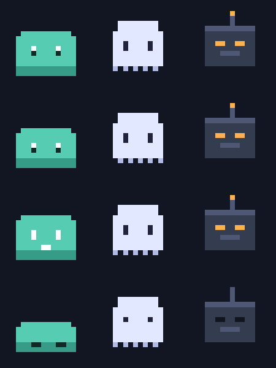

# Community profiles

Drop-in companions. Download a `.companion.json`, then in Pilotwick open
**Companion Studio → Custom art → Import**. Everything the profile needs —
every frame of artwork — is bundled inside that one file.

| Profile | What it is |
|---|---|
| [`blip.companion.json`](blip.companion.json) | A cheerful slime. Squashes flat for a nap. |
| [`wisp.companion.json`](wisp.companion.json) | A soft ghost, after Pilotwick's own mark. |
| [`bolt.companion.json`](bolt.companion.json) | A minimal robot head, for people who want zero cute. |

These three are starters, drawn in code so they are unambiguously MIT-safe.
They exist to show the format working — please do better than them.

## Contributing one

1. Build it in **Companion Studio → Custom art**. Only `idle` is required;
   every other mood falls back to it, so start with one frame and grow.
2. **Export & share** produces a single self-contained file.
3. Open a PR adding it here, plus a row in the table above.

**Only art you can license under MIT.** No frames from films, games or anime,
however well they fit — a profile built from someone else's artwork is still
someone else's artwork, and it puts the whole project at risk.
